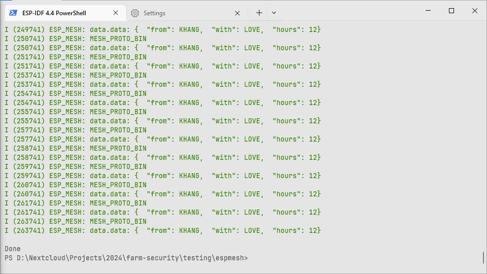

# Directory Structure

## Wifi (ESP32 to ESP8266)
Goals: User can config ESP32 connect to Router using HTTPD (Apache HTTP Server).

*
X is dont care. Example: (0,X) is no matter `connected` value if `config` is 0 WIFI_START will switch to STA_INIT.
*

## EPS MESH (ESP to ESP)

*
**ESP_MESH:** OUTPUT ESP ROOT MESH.
*

## CAMERA_EXAMPLE

This is an example using `esp_camera.h` module to test OV2640 camera.

## Camera_tcp_client

Take picture from camera as formated as jpeg, then send to server Ipv4 ip_addr
